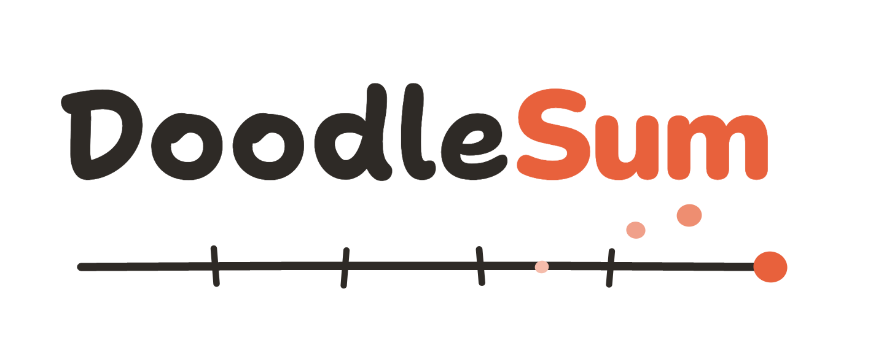
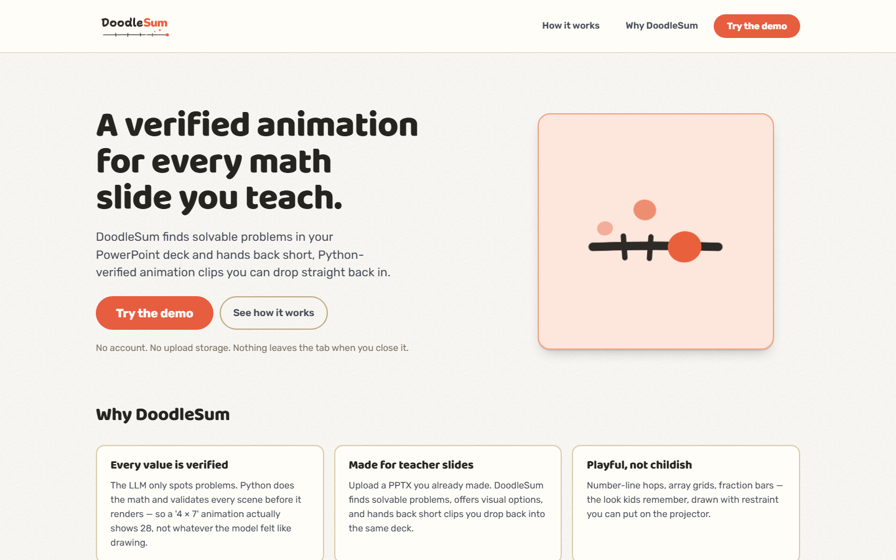
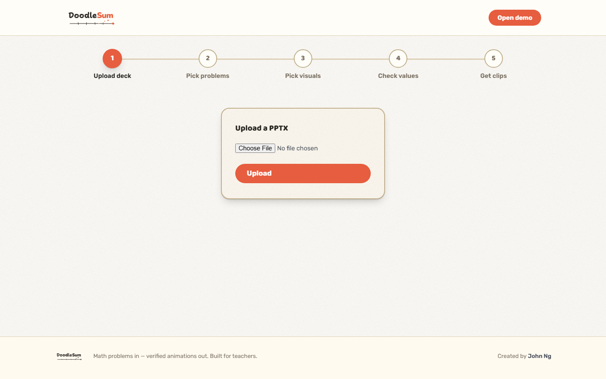
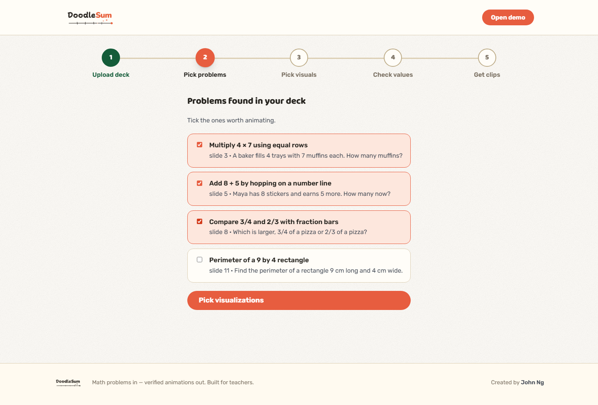
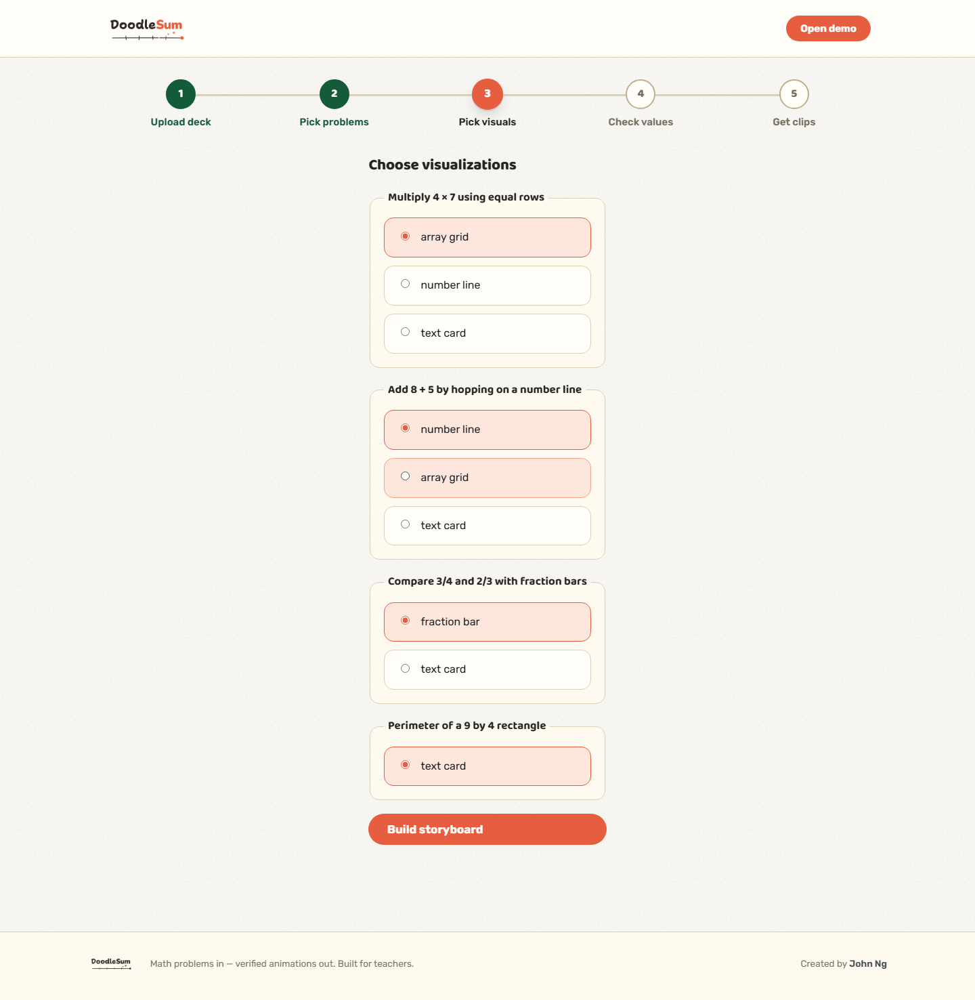
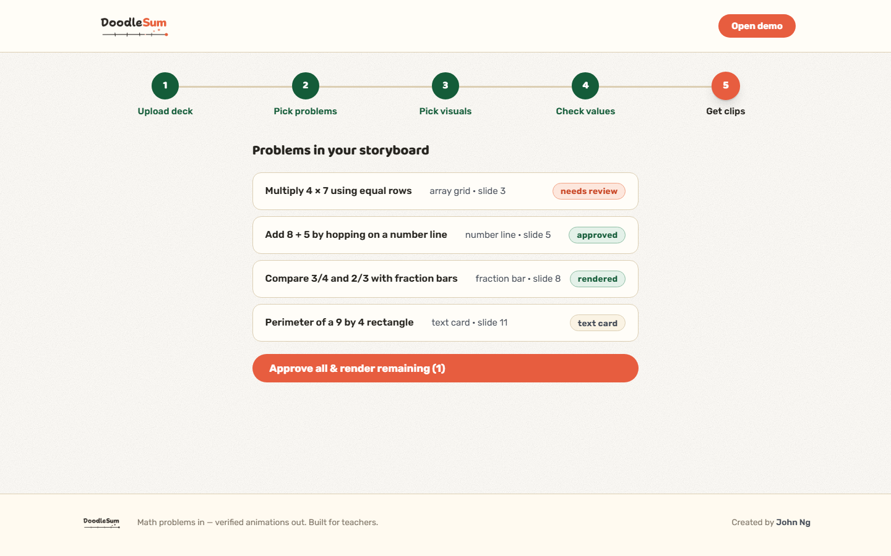
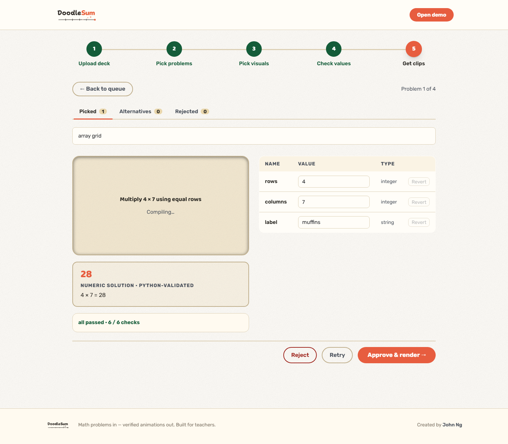
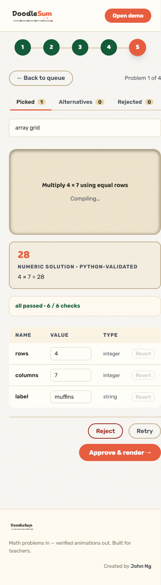

<div align="center">

<picture>
  <source media="(prefers-color-scheme: dark)" srcset="frontend/public/brand/doodlesum-wordmark-dark.png">
  <source media="(prefers-color-scheme: light)" srcset="frontend/public/brand/doodlesum-wordmark-light.png">
  
</picture>

### A verified animation for every math slide you teach.

Upload the PowerPoint deck you already wrote. DoodleSum finds the solvable K–8 math
problems in it, offers ranked visual templates for each, recomputes every number in
Python, and hands back short Manim-rendered MP4 clips you drop straight back into the
same deck.

**The model never does arithmetic.** It spots problems, proposes structurally compatible
templates, and extracts parameters. Every running total, equality and answer is
recomputed and validated in Python before a single frame is drawn.

<sub>FastAPI · Manim · Amazon Bedrock (Claude) · React + Vite · Postgres · Redis · Docker</sub>

</div>

<div align="center">
  
</div>

---

## Table of contents

- [What it does](#what-it-does)
- [The interface](#the-interface)
- [How it works](#how-it-works)
- [Repository layout](#repository-layout)
- [Running it — Docker](#running-it--docker)
- [Running it — bare metal](#running-it--bare-metal)
- [Configuration](#configuration)
- [Meta-templates (experimental)](#meta-templates-experimental)
- [Testing](#testing)
- [API](#api)
- [Honest limits](#honest-limits)
- [Credits](#credits)

---

## What it does

| | |
|---|---|
| **Every value is verified** | The LLM only *spots* problems. Python does the math and validates every scene before it renders — so a `4 × 7` animation actually shows **28**, not whatever the model felt like drawing. |
| **Made for teacher slides** | Upload a PPTX you already made. DoodleSum finds solvable problems, offers visual options, and hands back short clips you paste back into the same deck. |
| **Playful, not childish** | Number-line hops, array grids, fraction bars — the look kids remember, drawn with restraint you can put on a projector. |
| **Honest fallbacks** | When extraction or rendering can't satisfy the chosen template, you get a labeled text card and the reason — never a confidently wrong animation. |

Built-in templates: `number_line`, `array_grid`, `fraction_bar`, `fraction_of_whole`,
`balance_scale`, and `text_card` (the always-available fallback).

---

## The interface

The flow is a five-stage rail: **upload deck → pick problems → pick visuals → check
values → get clips.**

<table>
<tr>
<td width="50%" valign="top">

**1 · Upload a deck**

PPTX only, ≤ 50 slides, ≤ 50 MB. Only the *text* of slides that look like problems is
read — no OCR of image-only slides.

</td>
<td width="50%" valign="top">



</td>
</tr>
<tr>
<td width="50%" valign="top">

**2 · Pick problems**

Discovery returns candidates with a one-line summary and the source excerpt it came
from, so you can see exactly which slide each one is anchored to. Tick the ones worth
animating.

</td>
<td width="50%" valign="top">



</td>
</tr>
<tr>
<td width="50%" valign="top">

**3 · Pick visuals**

Each selected problem is classified into the templates that structurally fit it, ranked.
`text_card` is always offered. A problem whose only option is a text card is the exact
case the meta-template loop can learn a new visual for.

</td>
<td width="50%" valign="top">



</td>
</tr>
<tr>
<td width="50%" valign="top">

**4 · Check values**

Building the storyboard compiles each pick into a scene program and surfaces the
Python-computed answer, the editable parameter table, and the quality gates that ran.
Nothing renders until you approve it.

</td>
<td width="50%" valign="top">



</td>
</tr>
</table>

### The review screen

Per problem: the preview stage, the **Python-validated numeric solution** with its
expression, the pacing / anchor / rendered-output gates, and a live parameter table.
Edit a value and the scene recompiles and revalidates. If the answer printed on your
slide disagrees with what Python computes, DoodleSum blocks approval and shows you both
numbers until you fix the values or explicitly acknowledge the mismatch.

<div align="center">
  
</div>

<details>
<summary><strong>It works on a phone too</strong></summary>
<br>
<div align="center">
  
</div>
</details>

---

## How it works

```
PPTX ──► discovery ──► classification ──► extraction ──► compile ──► gates ──► Manim ──► MP4
         (LLM)         (LLM, ranked)      (LLM, params)  (Python)   (Python)  (render)

                                          └──────────── every number recomputed ─────────┘
```

1. **Discovery** (`app/pipeline/discovery.py`) — the deck's slide text is parsed
   (`python-pptx`, guarded by `pptx_guard.py`) and the model returns candidate problems,
   each with a source excerpt and slide index.
2. **Classification** (`classification.py`) — per selected candidate, the model proposes
   the templates that are *structurally* compatible and infers a grade level. It ranks;
   it does not compute.
3. **Extraction** (`extraction.py`) — the model fills the chosen template's parameter
   schema from the source text. Values are grounded against the excerpt
   (`grounding.py`).
4. **Verification** (`template_answers.py`, `mismatch.py`) — Python computes the answer
   from the extracted parameters and compares it to any answer stated on the slide. A
   disagreement becomes a blocking, teacher-visible mismatch.
5. **Compile + gates** (`compile.py`) — `(template, params)` deterministically compiles
   to a scene program with a stable hash. Pacing, anchor-alignment and rendered-output
   gates run before the scene is reviewable.
6. **Render** (`app/render/`, `app/templates/`) — Manim renders the approved scene to
   MP4; the clip is served by server-issued id.

If any step can't honestly satisfy the chosen template, the scene degrades to a labeled
`text_card` carrying its `fallback_reason` — a visible failure, not a silent one.

**Session state is in-memory** (uploads, candidates, clips, thumbnails). It does not
survive a restart, and it is not shared across processes — see
[single-process deployment](#single-process-only).

---

## Repository layout

```
backend/
  app/
    routes.py           upload / options / storyboard / render / clips endpoints
    pipeline/           discovery, classification, extraction, grounding, compile
    templates/          hand-authored Manim scenes (number_line, array_grid, …)
    render/             render workers
    meta/               meta-template generation, review + teacher APIs (opt-in)
    config.py           all settings + feature flags
  tests/                pytest suite (pipeline, routes, templates, render, meta, eval)
frontend/
  src/pages/            Landing, DemoShell, Queue (stages), Focus (review)
  src/components/       StageRail, ParamTable, PreviewStage, GatesDisclosure, …
  e2e/                  Playwright smoke tests (Bedrock mocked)
docs/
  DEPLOY.md             Docker deploy runbook
  meta-template-demo.md meta-template demo runbook
  screenshots/          the images in this README
  design/               design comps
docker-compose.*.yml    container stack (prod + dev + tls overlays)
Makefile                `make help` for every workflow shortcut
demo.ps1                Windows equivalent of the Makefile targets
```

---

## Running it — Docker

Recommended for demos and for a machine without the native Manim toolchain. Brings up
nginx + backend + Postgres + Redis with rate limits and Bedrock cost guards.

```bash
make env      # create .env from .env.docker.example, then fill in REPLACE_ME values
make up       # build + start on http://localhost
make logs     # tail everything
make down     # stop (keep volumes)
```

Frequently used targets: `make dev` (hot-reload backend + Vite), `make frontend`,
`make tls` (public URL via Caddy), `make nuke`, `make help`.

**On Windows** (no `make`), use the PowerShell wrapper, which passes the `--profile meta`
and `--build` flags the demo needs:

```powershell
.\demo.ps1 start     # bring the stack up, then open http://localhost
.\demo.ps1 logs
.\demo.ps1 stop
```

> The frontend is compiled into the nginx image at **build time**, so a source change is
> only served after a rebuild. `demo.ps1` always passes `--build`; with raw
> `docker compose up -d` you will silently keep serving the old bundle.

Full runbook — TLS, environment variables, rate limits, the Bedrock kill switch,
backups, troubleshooting: **[docs/DEPLOY.md](docs/DEPLOY.md)**.

---

## Running it — bare metal

Faster iteration if you already have the native toolchain.

### Prerequisites

- **Python 3.11+**
- **Node 18+** and npm
- **ffmpeg** — video encoding
- **Cairo + Pango + pkg-config** — Manim native rendering deps
- **LaTeX** (`latex` + `dvisvgm`) — number-line labels use MathTeX
- **AWS credentials with Amazon Bedrock access** — required for `/upload`, `/options`
  and `/storyboard`

macOS (Homebrew):

```bash
brew install ffmpeg cairo pango pkg-config
brew install --cask basictex     # then: sudo tlmgr install standalone preview doublestroke dvisvgm
```

Homebrew binaries and LaTeX must be on `PATH` when rendering:

```bash
export PATH="/Library/TeX/texbin:/opt/homebrew/bin:$PATH"
```

### Backend

```bash
cd backend
python3 -m venv ../.venv
../.venv/bin/pip install -e ".[dev]"

# configure credentials (see Configuration below), then:
PATH="/Library/TeX/texbin:/opt/homebrew/bin:$PATH" ../.venv/bin/uvicorn app.main:app --port 8000 --reload --no-proxy-headers
```

Backend serves on `http://localhost:8000`; interactive API docs at `/docs`.

`--no-proxy-headers` is not optional. uvicorn's proxy-header handling defaults to
**on** and rewrites the client address from `X-Forwarded-For` before the app sees
it, whenever the connecting peer is in `forwarded_allow_ips` — and the default
allows loopback, which is exactly this setup. Without the flag any local caller
can name themselves with a header, and `TRUST_FORWARDED_FOR=false` cannot take
effect. `backend/tests/test_middleware.py` scans the repo and fails on any
uvicorn launch command missing it.

#### Single process only

Session state is an in-memory `OrderedDict` in the backend process. Do **not** run
`uvicorn --workers N` (N > 1) or put multiple backend instances behind a load balancer:
each worker keeps its own session universe, so a request routed to a process that never
saw the upload returns 400. Stay on one worker per instance until session state moves to
a durable store.

### Frontend

```bash
cd frontend
npm install
npm run dev       # http://localhost:5173
npm run build     # production build → frontend/dist/
```

The Vite dev server proxies `/upload`, `/options`, `/storyboard`, `/render`, `/clips`,
`/thumbnails` and `/meta` to the backend on `:8000`, so the browser talks to one origin
and the session cookie flows without cross-origin friction.

**Start the backend first.** Then open `http://localhost:5173` and walk the five stages.

---

## Configuration

Settings are read from environment variables or `backend/.env`
(see `backend/app/config.py`; the Docker stack uses root `.env`, seeded from
`.env.docker.example`).

| Variable | Default | Purpose |
|---|---|---|
| `AWS_REGION` | `us-east-1` | Bedrock region |
| `BEDROCK_MODEL_ID` | `global.anthropic.claude-sonnet-4-6` | Model used for discovery / classification / extraction |
| `AWS_ACCESS_KEY_ID` / `AWS_SECRET_ACCESS_KEY` / `AWS_SESSION_TOKEN` | — | Optional; the standard AWS credential chain works too |
| `DATABASE_URL` | SQLite at `META_DB_PATH` | Postgres DSN in Docker |
| `REDIS_URL` | — | Unset ⇒ Bedrock rate limiting degrades to a no-op |
| `BEDROCK_DISABLED` | `false` | Master kill switch — every Bedrock call raises |
| `BEDROCK_DAILY_CALL_CAP` | `0` (off) | Global calls per UTC day before 429 |
| `BEDROCK_PER_IP_HOURLY_CAP` | `0` (off) | Per-client-IP calls per rolling hour |
| `MEDIA_MAX_BYTES` | `0` (off) | Ceiling on clips + thumbnails; swept periodically |
| `CORS_ALLOW_ORIGINS` | `http://localhost:5173` | Comma-separated origins |
| `SESSION_COOKIE_SECURE` | `false` | Set true behind HTTPS |
| `META_TEMPLATES_ENABLED` | `false` | Mounts the meta-template routers |

---

## Meta-templates (experimental)

The meta-template system can learn a bounded, reviewable animation template from a
concrete problem that fell back to `text_card`, then reuse the published template for
structurally similar problems.

Generation produces a **semantic teaching plan**, not animation code: one learning
objective, one primary semantic visual, a closed explanation strategy, and three to five
ordered teaching beats ending in an explicit conclusion. A deterministic compiler lowers
that plan into a parameterized scene program, and every preview and render resolves the
program against current field values (measure → lay out → resolve anchors → bind the
timeline → render). Static and rendered quality gates run privately before a draft
becomes reviewable, so a reviewer only ever sees candidates whose pacing, anchors and
rendered frames already pass.

The bundled demo publishes two lessons — a rectangle perimeter (`boundary_trace`) and a
median of seven (`pair_elimination`) — then reuses the perimeter template on a second
problem. Setup, presentation sequence, checkpoints, reset steps and troubleshooting live
in the canonical
**[meta-template demo runbook](docs/meta-template-demo.md)**.

> The v3 teaching-plan schema replaces the earlier generated-animation-document format
> outright: **v1/v2 drafts and published versions are intentionally unsupported.** After
> migrating, reset the disposable demo database as the runbook describes rather than
> reusing older drafts.

**Keep all meta-template flags disabled in production** until the operational rollout
work is complete.

---

## Testing

```bash
cd backend
PATH="/Library/TeX/texbin:/opt/homebrew/bin:$PATH" ../.venv/bin/python -m pytest
```

Pipeline and route tests mock Bedrock, so **no AWS credentials are needed**. The render
smoke tests invoke real Manim + ffmpeg (a few minutes; the `PATH` prefix is required).
The held-out release-candidate eval is excluded by default — opt in with `pytest -m rc`.

Frontend:

```bash
cd frontend
npm test          # vitest — component + unit tests
npm run e2e       # Playwright smoke; MATH_ANIM_MOCK_BEDROCK=1, no AWS needed
npm run build     # production build → frontend/dist/
```

---

## API

| Method | Path | Purpose |
|---|---|---|
| `POST` | `/upload` | Multipart PPTX (`.pptx` only, ≤ 50 slides, ≤ 50 MB) → discovered candidates + httponly session cookie |
| `POST` | `/options` | `{ "candidate_ids": [...] }` → ranked compatible templates + rationale per candidate |
| `POST` | `/storyboard` | `{ "picks": [{ "candidate_id", "template" }] }` → compiled scenes with params, schema, computed answer and gates |
| `PATCH` | `/storyboard/{scene_id}` | Edit params or override grade; revalidates and recompiles |
| `POST` | `/storyboard/{scene_id}/approve` | Approve for render (409 while an unacknowledged mismatch stands) |
| `POST` | `/storyboard/{scene_id}/acknowledge-mismatch` | Accept the Python-computed value over the slide's |
| `POST` | `/storyboard/{scene_id}/retry` · `/reject` | Re-extract, or drop the scene |
| `POST` | `/storyboard/chain` · `/storyboard/{scene_id}/ungroup` | Group scenes into one clip, or split them again |
| `POST` | `/render` | Render approved scenes → clip URL, status, or fallback reason |
| `GET` | `/clips/{clip_id}` · `/thumbnails/{thumb_id}` | Fetch a rendered MP4 / first-frame thumbnail |
| `GET` | `/healthz` | Liveness |

Mounted only when `META_TEMPLATES_ENABLED=1`: `/meta/my/*` (teacher: capabilities,
builds, drafts, approve/reject) and the reviewer-token-gated `/meta/*` admin routes.

---

## Honest limits

- Math only — arithmetic, geometry and fractions to start.
- 2D visualizations. No 3D, no free-form graphing.
- PPTX in — no OCR, so problems that exist only as pictures are not detected.
- No accounts, no persistence: session state is in-memory and ends when the process
  restarts or the tab closes.
- Single backend process (see [above](#single-process-only)).

---

## Credits

Created by **[John Ng](https://www.linkedin.com/in/johnn05/)**.
